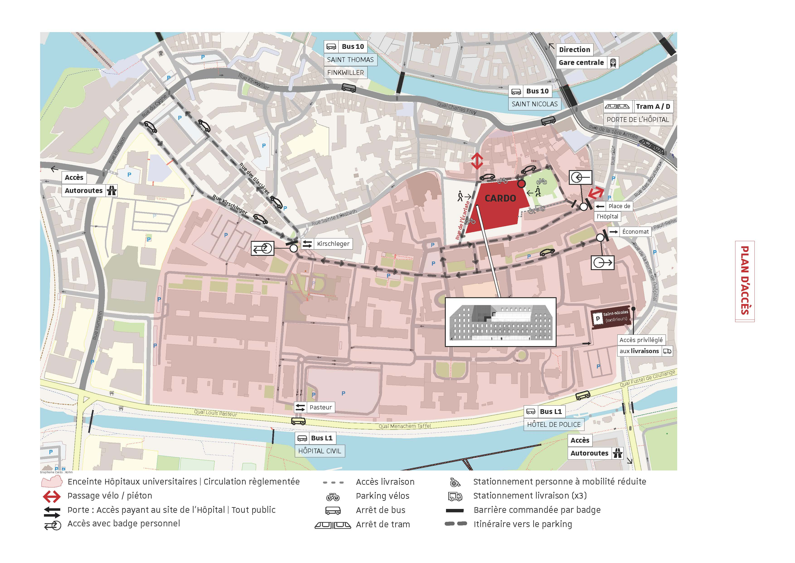

# Présentation du CEIPI

## Informations Générales
CEIPI (Centre d'études internationales de la propriété intellectuelle) est une composante sous forme d’institut de l’université de Strasbourg, créer en 1963, à l’initiative des professeurs Daniel Bastien et Hubert Forestier. Dès sa création, le CEIPI s’est donnée la mission de former des spécialistes du droit de la propriété intellectuelle qui seront chargés d’exercer les différentes professions dans le domaine de la propriété intellectuelle. 

CEIPI s’est installé le 2 mars 2020 dans un nouveau bâtiment situé dans l'enceinte de l'Hôpital civil à Strasbourg


```{r Location du CEIPI, fig.cap='Location du CEIPI', out.width='80%', fig.asp=.75, fig.align='center',echo=FALSE}

```

## La structure
Le centre était composé de trois sections : 
La section française dispense aux spécialistes français un enseignement en matière de propriété intellectuelle à l'échelle nationale et internationale. 

La section internationale consacre son programme de formation au contrat de licence et s'adressait aux spécialistes français et étrangers, désirant acquérir des connaissances nécessaires de droit international. 

Le laboratoire de Recherche du CEIPI, créé en 2006, sa dénomination officielle est UR 4375-Laboratoire de recherche du CEIPI. Il coordonne des activités variées pour la mission de réflexion quant à l’évolution du droit de la propriété intellectuelle dans la société de la connaissance.

Plus des informations sur le site du CEIPI :https://www.ceipi.edu/

