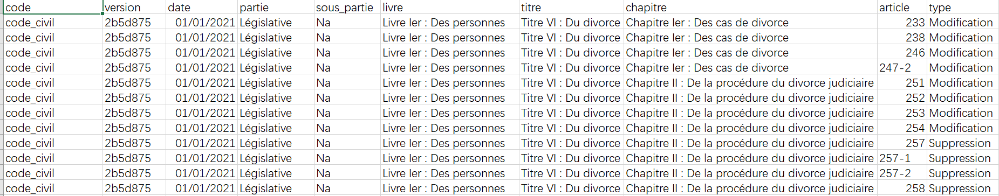
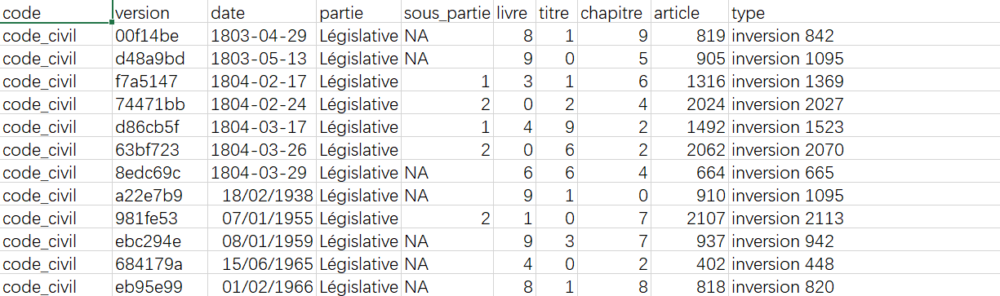
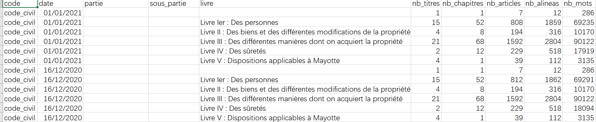
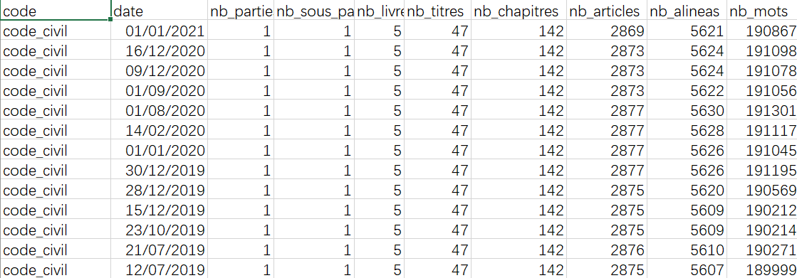
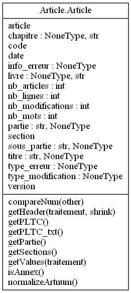
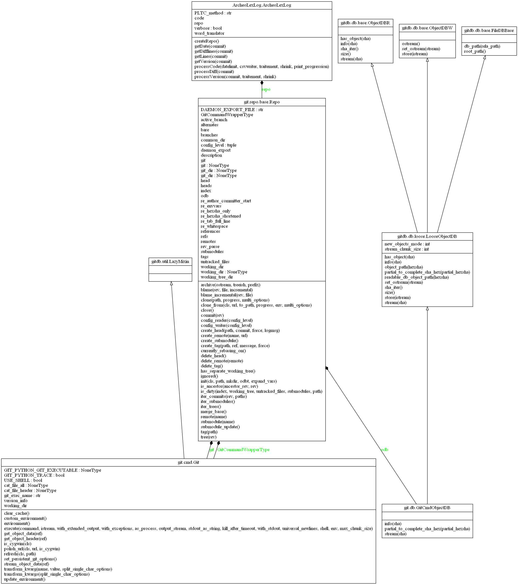

---
output:
  pdf_document: default
  html_document: default
---
# Application archeolex_excavation.py {#Application}

## Présentation Générale

**Rôle** : archeolex_excavation.py est utilisée pour fouiller des dépôts git Archéo Lex et générer des fichiers csv. Nous pouvons générer différents fichiers csv en modifiant les paramètres dans la ligne de commande.

**Usage** : archeolex_excavation.py [-h] [-d YYYY-MM-DD] [-f fichier.csv] [-t] [-v] diff|check| |stats [code ...]

**Example**:
```{r ligne de commande, echo=TRUE, eval=FALSE}
archeolex_excavation.py stats code_civil -d last -t -s1 -f test.csv
```

### Les paramètres

#### Positional arguments

| nom de paramètre| signification |
| ------ | ------ | 
| **diff/check/status **|**Le traitement à effectuer**|            
| diff | obtenir les informations de modification par article|
| check | détecter des erreurs des codes|
| status |  Les informations de sous-section d'une section, ainsi que le nombre de lignes et de mots dans cette section.Les paramètres d'entrée -s1 à -s6 (voir ci-dessous) pour confirmer le niveau de cette section.|
| **codes **|**La liste des codes à fouiller**| 

##### Les niveaus généraux de la structure des codes

Partie

Sous_partie

Livre

Titre

Chapitre

#### Optional arguments
| nom de paramètre| signification | 
| ------ | ------ | 
|  -h, --help | montrer le message de help et quitter |
|  -d YYYY-MM-DD, --datelimit YYYY-MM-DD| définir une date maximum pour la fouille |
|  -f nom.csv, --file nom.csv| écrit les données dans ce fichier csv (sortie standard par défaut)|
|  -t, --fulltext | détecter les noms entiers des section|
|  -s1 | Obtenir les informations de chaque chapitre|
|  -s2 | Obtenir les informations de chaque livre|
|  -s3 | Obtenir les informations de chaque titre|
|  -s4 | Obtenir les informations de chaque sous partie|
|  -s5 | Obtenir les informations de chaque partie|
|  -s6 | Obtenir les informations de chaque code|

#### Quelques fichies csv générés

##### Example 1:
```{r diff, fig.cap='les informations de modification par article', out.width='80%', fig.asp=.75, fig.align='center',echo=FALSE}

```
##### Example 2:
L’application permet de détecter des erreurs de deux types :

- doublon : articles apparaissant deux fois dans un code ;
- inversion : deux articles consécutifs dont la numérotation n’est pas croissante.
Cette détection d’erreur est imparfaite, et n’exclu ni faux-positifs ni faux-négatifs. La date correspond à la version la plus ancienne à laquelle l’erreur a été détectée.

Les erreurs détectées sur un échantillon de codes se trouvent dans le fichier errors.csv, au format suivant :
```{r check, fig.cap='détecter des erreurs des codes', out.width='80%', fig.asp=.75, fig.align='center',echo=FALSE}

```

##### Example 3
```{r stats3, fig.cap='Les informations de sous-section des livres, ainsi que le nombre de lignes et de mots pour chaque livres.', out.width='80%', fig.asp=.75, fig.align='center',echo=FALSE}

```

##### Example 4
```{r stats6, fig.cap='Les informations de sous-section des chapitres, ainsi que le nombre de lignes et de mots pour chaque chapitre.', out.width='80%', fig.asp=.75, fig.align='center',echo=FALSE}

```

## Présentation technique

### La structure des codes
L'idée de code python est **orientée objet**,il y a trois fichiers python：

1.**Article.py**: un article doit être considéré comme un objet, et les attributs liés à l'article peuvent être trouvés dans cette classe. Par exemple, le chapitre, le livre , le code où il se trouve, sa date, etc. (voir l'UML dans la figure ci-dessous pour plus de détails).
Les fonctions permettent de modifier ou d'obtenir la valeur des attributs d'article.
```{r Article, fig.cap='le diagramme UML pour Article.py', out.width='25%', fig.asp=.75, fig.align='center',echo=FALSE}

```

2.**ArcheoLexLog.py**:
Le rôle de cette classe est de stocker des fonctions d'exploration et d'analyse de données. Cette classe appelle la classe Article et appelle également un package très important GitPython* pour obtenir des informations de git diff.
```{r ArcheoLexLog, fig.cap='le diagramme UML pour ArcheoLexLog.py', out.width='50%', fig.asp=.75, fig.align='center',echo=FALSE}

```

3.**archeolex_excavation.py**:Ce fichier appelle les deux classes Article et ArcheoLexLog, définit les paramètres et contient la fonction main.

### problèmes rencontrés et solution
-1.Au début,l'idée était d'obtenir les informations de la structure de l'article à partir du nom. Par exemple : Article L312 -> L'article se trouve dans la partie législative, le troisième livre, le premier titre, le deuxième chapitre.
Cependant, il existe huit lois et leurs noms d'articles ne sont pas liés à la structure : code_civil code_de_l'artisanat code_de_la_famille_et_de_l'aide_sociale code_de_procédure_civile code_de_procédure_pénale code_des_postes_et_des_communicet_pélectroniquedemaraire_demarale_demarique

**Solution**: parcourir le texte complet du diff pour obtenir les informations de structure correspondantes. Et le nom complet(fulltext) de la structure est directement écrit dans la table sans utiliser le nom numérique.

-2.Un changement structurel après un commit. Par exemple: une nouvelle sous_section est ajoutée

**Solution**: ajouter du code pour détecter et enregistrer ce changement.

-3.Les dépots git sur Archeo Lex ont des problème. Par exemple: il y a un problème avec l'ordre des articles, et le même article du même commit a été modifié plusieurs fois.

**Solution**: ajout d'un paramètre check pour détecter et afficher les erreurs, et envoyer les erreurs à Archeo Lex.


