---
output:
  pdf_document: default
  html_document: default
---
# Les images générés {#Images}


## modification et des visualisations

### Liste des codes et modifications
<table>
 <thead>
  <tr>
   <th style="text-align:left;"> code </th>
   <th style="text-align:right;"> nb_modifs </th>
   <th style="text-align:left;"> début </th>
   <th style="text-align:left;"> fin </th>
   <th style="text-align:right;"> parties </th>
   <th style="text-align:right;"> sous_parties </th>
   <th style="text-align:right;"> livres </th>
   <th style="text-align:right;"> titres </th>
   <th style="text-align:right;"> chapitres </th>
  </tr>
 </thead>
<tbody>
  <tr>
   <td style="text-align:left;"> code_civil </td>
   <td style="text-align:right;"> 6248 </td>
   <td style="text-align:left;"> 1803-03-15 </td>
   <td style="text-align:left;"> 2021-01-01 </td>
   <td style="text-align:right;"> 1 </td>
   <td style="text-align:right;"> 1 </td>
   <td style="text-align:right;"> 7 </td>
   <td style="text-align:right;"> 70 </td>
   <td style="text-align:right;"> 214 </td>
  </tr>
  <tr>
   <td style="text-align:left;"> code_de_commerce </td>
   <td style="text-align:right;"> 16455 </td>
   <td style="text-align:left;"> 2000-12-14 </td>
   <td style="text-align:left;"> 2021-05-23 </td>
   <td style="text-align:right;"> 4 </td>
   <td style="text-align:right;"> 1 </td>
   <td style="text-align:right;"> 11 </td>
   <td style="text-align:right;"> 80 </td>
   <td style="text-align:right;"> 254 </td>
  </tr>
  <tr>
   <td style="text-align:left;"> code_de_l'action_sociale_et_des_familles </td>
   <td style="text-align:right;"> 8513 </td>
   <td style="text-align:left;"> 2001-07-18 </td>
   <td style="text-align:left;"> 2021-05-21 </td>
   <td style="text-align:right;"> 3 </td>
   <td style="text-align:right;"> 1 </td>
   <td style="text-align:right;"> 8 </td>
   <td style="text-align:right;"> 49 </td>
   <td style="text-align:right;"> 238 </td>
  </tr>
  <tr>
   <td style="text-align:left;"> code_de_l'éducation </td>
   <td style="text-align:right;"> 10754 </td>
   <td style="text-align:left;"> 2000-12-14 </td>
   <td style="text-align:left;"> 2021-05-24 </td>
   <td style="text-align:right;"> 2 </td>
   <td style="text-align:right;"> 6 </td>
   <td style="text-align:right;"> 15 </td>
   <td style="text-align:right;"> 97 </td>
   <td style="text-align:right;"> 274 </td>
  </tr>
  <tr>
   <td style="text-align:left;"> code_de_la_consommation </td>
   <td style="text-align:right;"> 6235 </td>
   <td style="text-align:left;"> 1994-01-04 </td>
   <td style="text-align:left;"> 2021-04-16 </td>
   <td style="text-align:right;"> 4 </td>
   <td style="text-align:right;"> 1 </td>
   <td style="text-align:right;"> 16 </td>
   <td style="text-align:right;"> 63 </td>
   <td style="text-align:right;"> 227 </td>
  </tr>
  <tr>
   <td style="text-align:left;"> code_de_la_propriété_intellectuelle </td>
   <td style="text-align:right;"> 3227 </td>
   <td style="text-align:left;"> 1993-01-01 </td>
   <td style="text-align:left;"> 2021-05-14 </td>
   <td style="text-align:right;"> 2 </td>
   <td style="text-align:right;"> 6 </td>
   <td style="text-align:right;"> 17 </td>
   <td style="text-align:right;"> 27 </td>
   <td style="text-align:right;"> 111 </td>
  </tr>
  <tr>
   <td style="text-align:left;"> code_de_la_recherche </td>
   <td style="text-align:right;"> 441 </td>
   <td style="text-align:left;"> 2004-08-11 </td>
   <td style="text-align:left;"> 2021-01-01 </td>
   <td style="text-align:right;"> 1 </td>
   <td style="text-align:right;"> 1 </td>
   <td style="text-align:right;"> 5 </td>
   <td style="text-align:right;"> 21 </td>
   <td style="text-align:right;"> 75 </td>
  </tr>
  <tr>
   <td style="text-align:left;"> code_de_la_santé_publique </td>
   <td style="text-align:right;"> 51280 </td>
   <td style="text-align:left;"> 1953-10-27 </td>
   <td style="text-align:left;"> 2021-05-27 </td>
   <td style="text-align:right;"> 6 </td>
   <td style="text-align:right;"> 10 </td>
   <td style="text-align:right;"> 87 </td>
   <td style="text-align:right;"> 290 </td>
   <td style="text-align:right;"> 1138 </td>
  </tr>
  <tr>
   <td style="text-align:left;"> code_de_la_sécurité_intérieure </td>
   <td style="text-align:right;"> 4700 </td>
   <td style="text-align:left;"> 2012-12-23 </td>
   <td style="text-align:left;"> 2021-05-27 </td>
   <td style="text-align:right;"> 2 </td>
   <td style="text-align:right;"> 1 </td>
   <td style="text-align:right;"> 9 </td>
   <td style="text-align:right;"> 59 </td>
   <td style="text-align:right;"> 165 </td>
  </tr>
  <tr>
   <td style="text-align:left;"> code_de_la_sécurité_sociale </td>
   <td style="text-align:right;"> 40633 </td>
   <td style="text-align:left;"> 1961-01-12 </td>
   <td style="text-align:left;"> 2021-05-23 </td>
   <td style="text-align:right;"> 5 </td>
   <td style="text-align:right;"> 1 </td>
   <td style="text-align:right;"> 37 </td>
   <td style="text-align:right;"> 185 </td>
   <td style="text-align:right;"> 646 </td>
  </tr>
  <tr>
   <td style="text-align:left;"> code_du_travail </td>
   <td style="text-align:right;"> 48381 </td>
   <td style="text-align:left;"> 1973-07-11 </td>
   <td style="text-align:left;"> 2021-05-27 </td>
   <td style="text-align:right;"> 6 </td>
   <td style="text-align:right;"> 9 </td>
   <td style="text-align:right;"> 76 </td>
   <td style="text-align:right;"> 342 </td>
   <td style="text-align:right;"> 1220 </td>
  </tr>
  <tr>
   <td style="text-align:left;"> code_pénal </td>
   <td style="text-align:right;"> 3235 </td>
   <td style="text-align:left;"> 1992-07-23 </td>
   <td style="text-align:left;"> 2021-05-27 </td>
   <td style="text-align:right;"> 2 </td>
   <td style="text-align:right;"> 1 </td>
   <td style="text-align:right;"> 11 </td>
   <td style="text-align:right;"> 31 </td>
   <td style="text-align:right;"> 87 </td>
  </tr>
</tbody>
</table>

### Pourcentage de différents types de modifications

#### Toutes les années

```
## `summarise()` has grouped output by 'année'. You can override using the `.groups` argument.
```

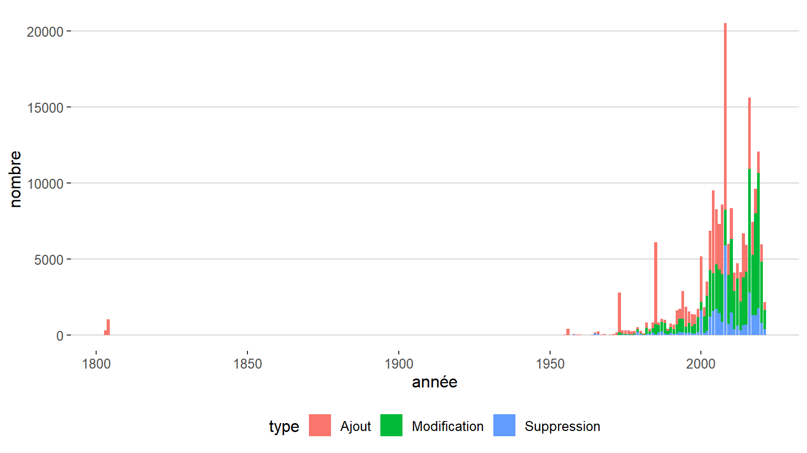

#### Depuis 1950

```
## `summarise()` has grouped output by 'année'. You can override using the `.groups` argument.
```


### Nombre de modifications de chaque année

#### Depuis 1950

```
## `summarise()` has grouped output by 'année'. You can override using the `.groups` argument.
```

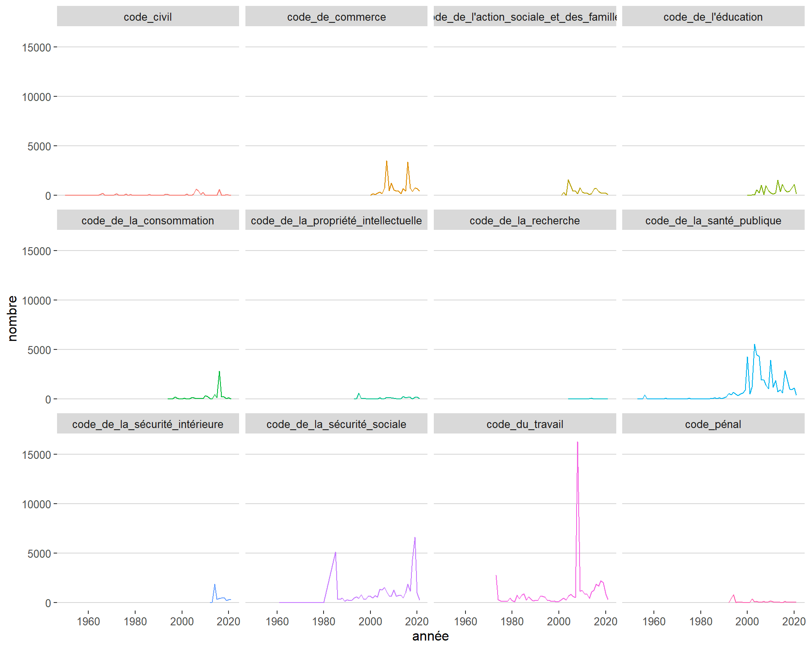

#### Depuis 1999

```
## `summarise()` has grouped output by 'année'. You can override using the `.groups` argument.
```

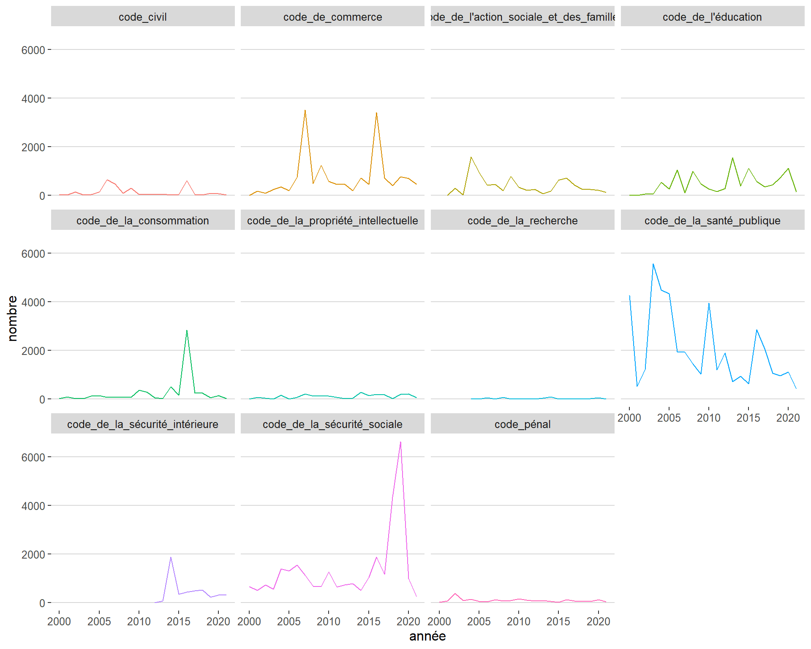


```
## `summarise()` has grouped output by 'code', 'partie', 'article'. You can override using the `.groups` argument.
```

### Etat actuel

```
## `summarise()` has grouped output by 'code'. You can override using the `.groups` argument.
```

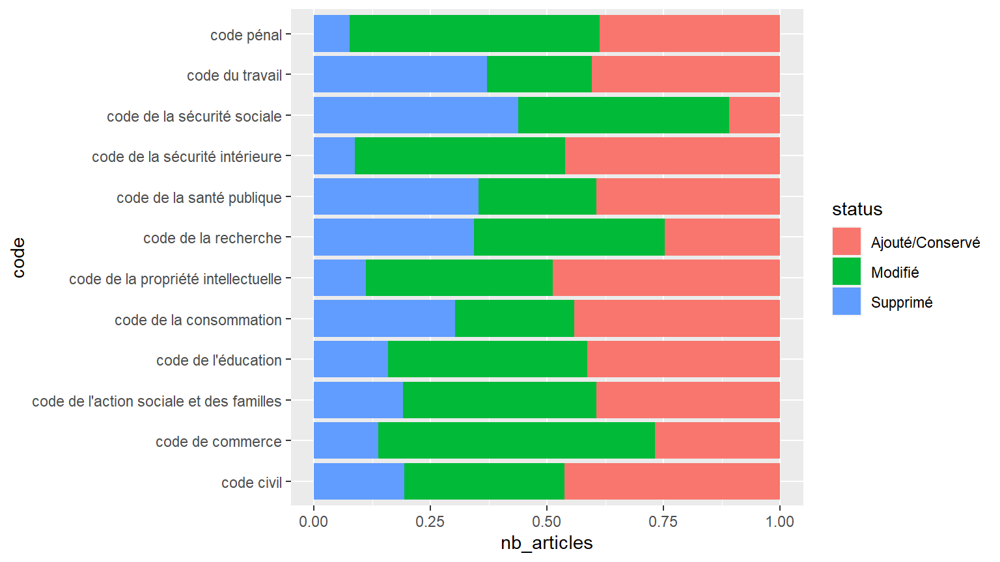

### Nombre modifications par articles


```
## Warning: Unknown levels in `f`: Pr閑xistence
```

```
## `summarise()` has grouped output by 'code', 'article'. You can override using the `.groups` argument.
```

```
## `summarise()` has grouped output by 'code', 'date'. You can override using the `.groups` argument.
```


### Evolution de nombre de modifications


## Evolution des volumes de codes


### Nombre de mots 
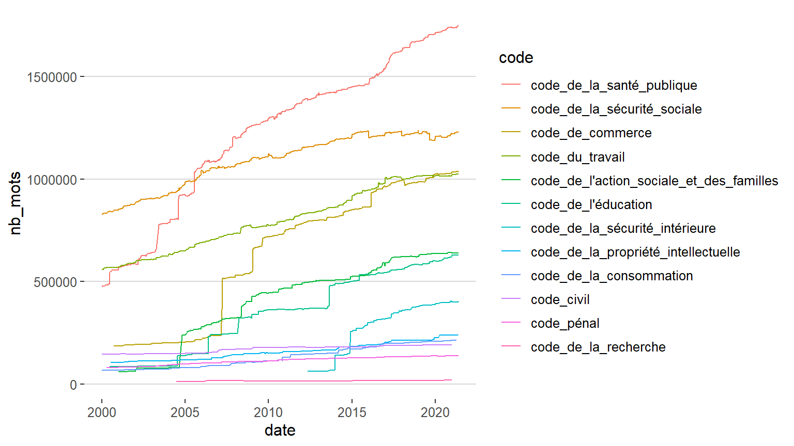

### Nombre de lignes 


### Nombre d'article 
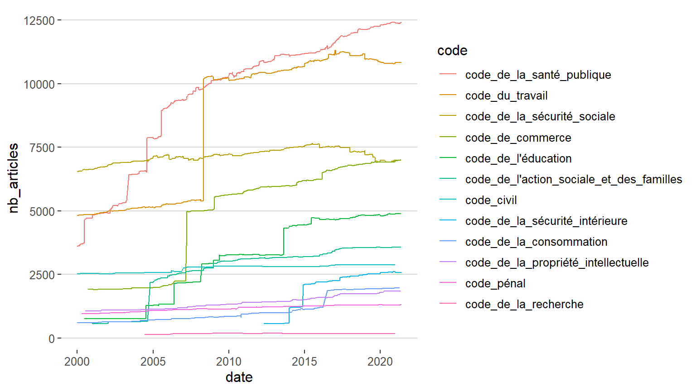


### Nombre moyen de lignes d'un article
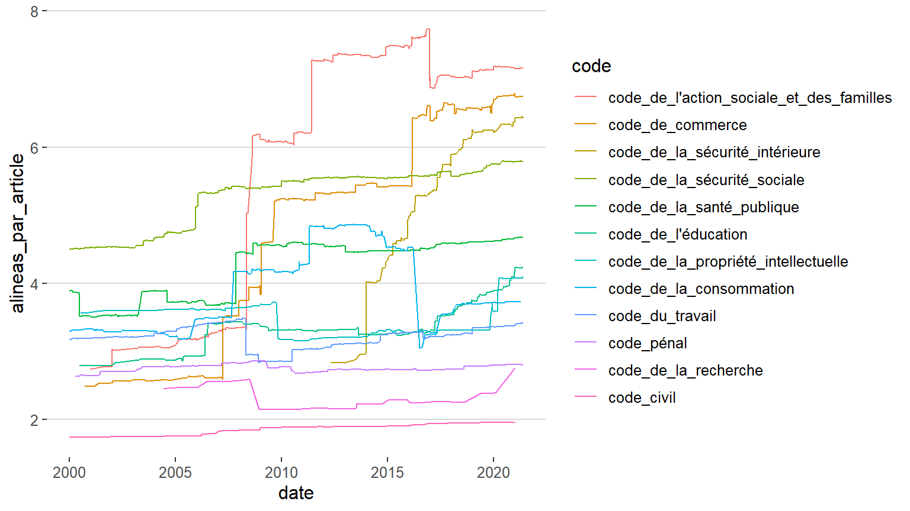


### Nombre moyen de mots d'un article
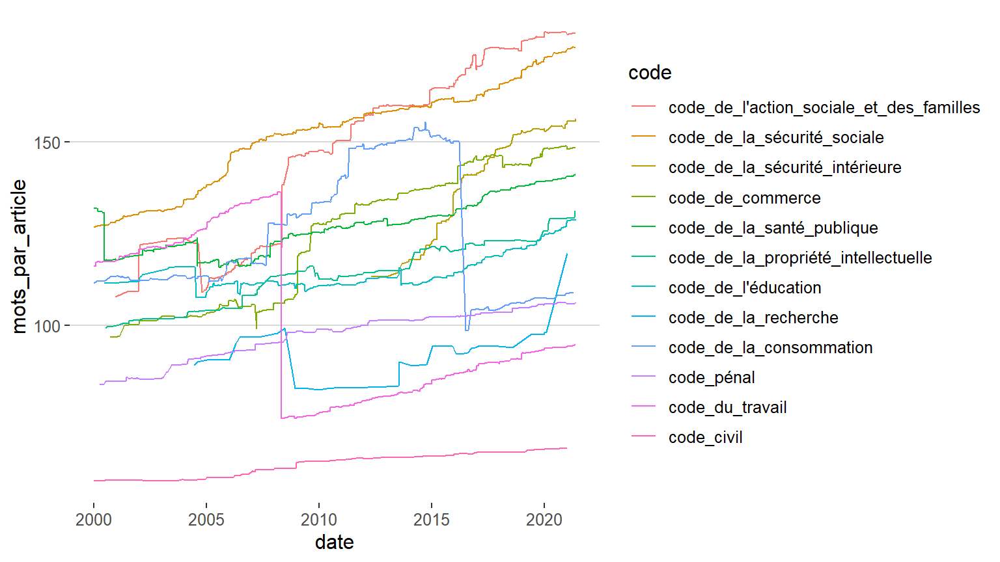

### Nombre moyen de mots d'une ligne


## Structure
### Législative vs. Réglementaire


#### Nombre de mots de chaque partie(séparées) 
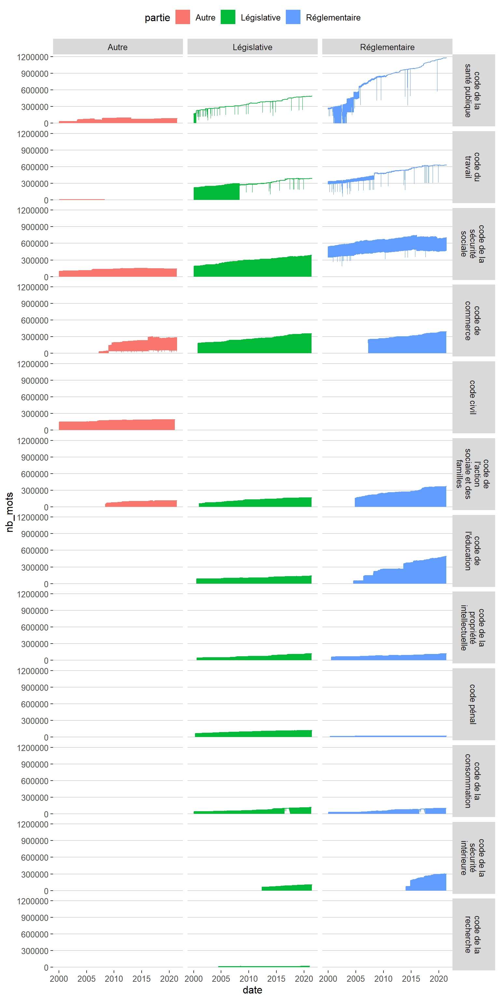

#### Nombre de mots de chaque partie(combinées) 
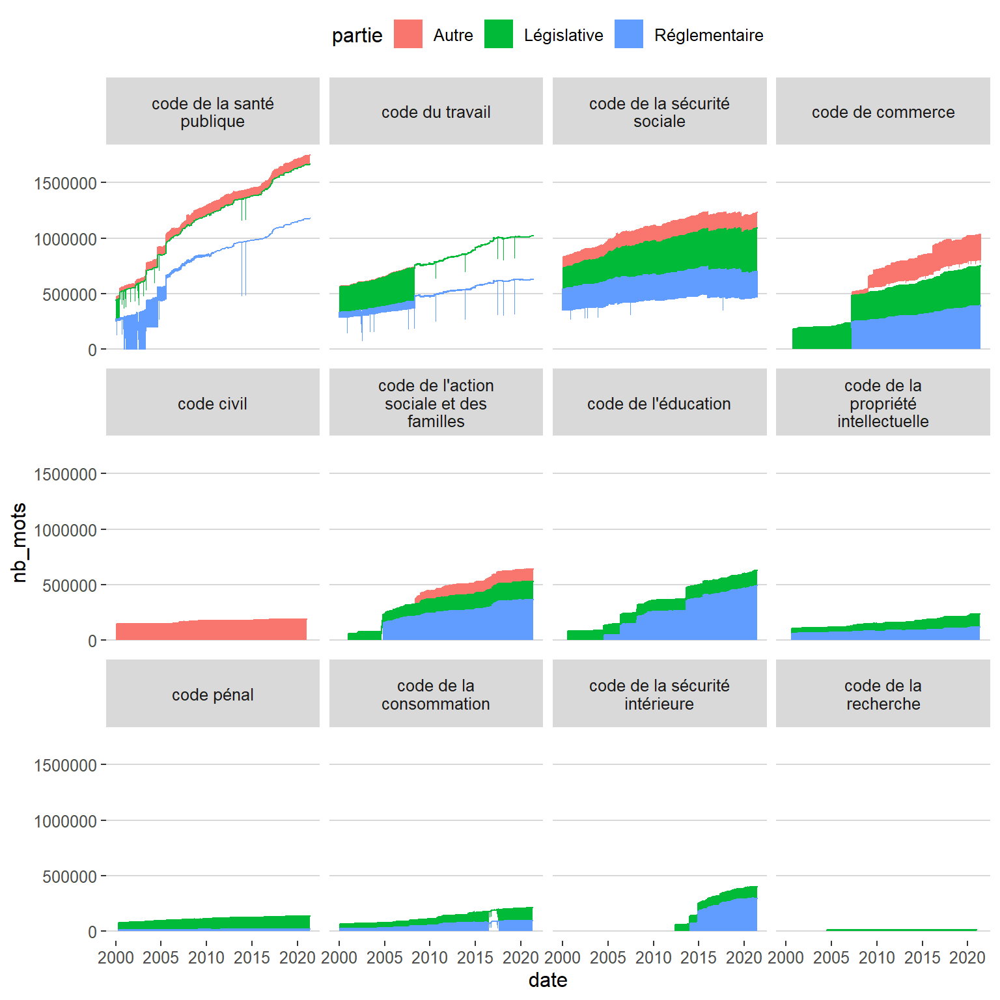

#### Pourcentage de chaque partie

```
## `summarise()` has grouped output by 'date', 'code'. You can override using the `.groups` argument.
```


### Arborescence


{r tree.edu, fig.width=15, fig.height=15, out.width=500, out.height=500, fig.align="center"}
legiplot_tree("code de l'éducation")


{r tree.pro, fig.width=15, fig.height=15, out.width=500, out.height=500, fig.align="center"}
legiplot_tree("Code de la propriété")


## Modification pour chaque livre 

### Code de l'éducation

```r
stats.det <- read.csv("../stats_shortlist_ts3.csv",encoding = 'UTF-8') %>%
  filter(code == "code_de_l'éducation") %>%
  mutate(date = as.Date(date)) 
stats.det %>%
  ggplot(aes(x=date,y=nb_mots,fill=livre)) +
  geom_area(aes(group=livre)) +
  facet_grid(.~partie)  +
  theme_hc() + 
  theme(legend.position = "right")
```


Premier problème : les livres ne sont pas dans l'ordre : Livre IX < Livre V

Pour traiter ce problème, on force l'ordre des livres avec l'ordre dans le csv:


```r
stats.det %>%
    mutate_at(
    c("partie","sous_partie","livre"),
    function(x) factor(x,unique(x))
    ) %>%
  ggplot(aes(x=date,y=nb_mots,fill=livre)) +
  geom_area(aes(group=livre)) +
  facet_grid(.~partie)  +
  theme_hc() + 
  theme(legend.position = "right")
```

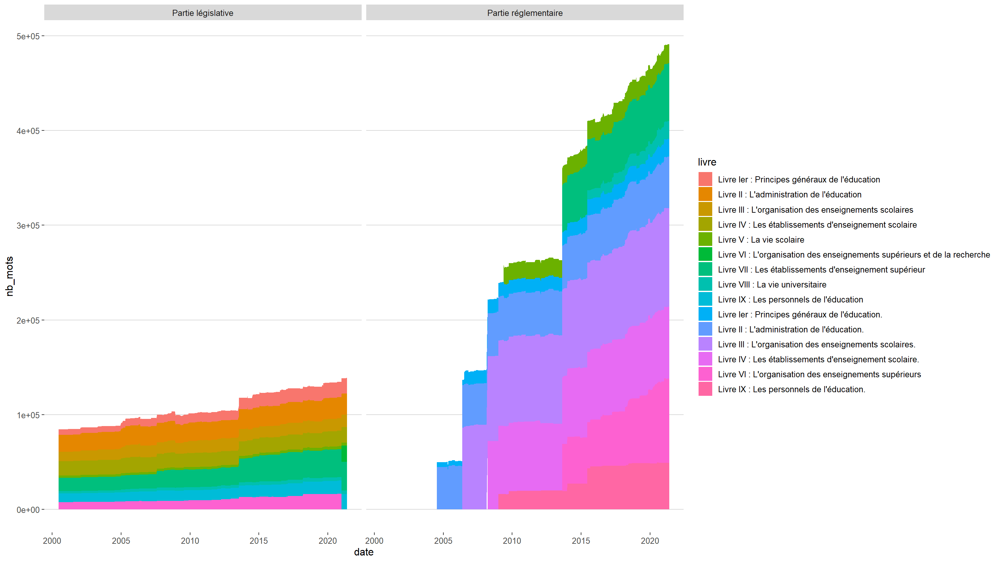

Deuxième problème : des titres changent au cours du temps.

Pour traiter ce problème, on va supprimer ces titres :


```r
stats.det %>%
  mutate_at(
    c("sous_partie","livre"),
    function(x) gsub("(.*) :.*", "\\1",x)
    ) %>%
    mutate_at(
    c("partie","sous_partie","livre"),
    function(x) factor(x,unique(x))
    ) %>%
  ggplot(aes(x=date,y=nb_mots,fill=livre)) +
  geom_area(aes(group=livre)) +
  facet_grid(.~partie)  +
  theme_hc() + 
  theme(legend.position = "right")
```


### Code de la propriété intellectuelle


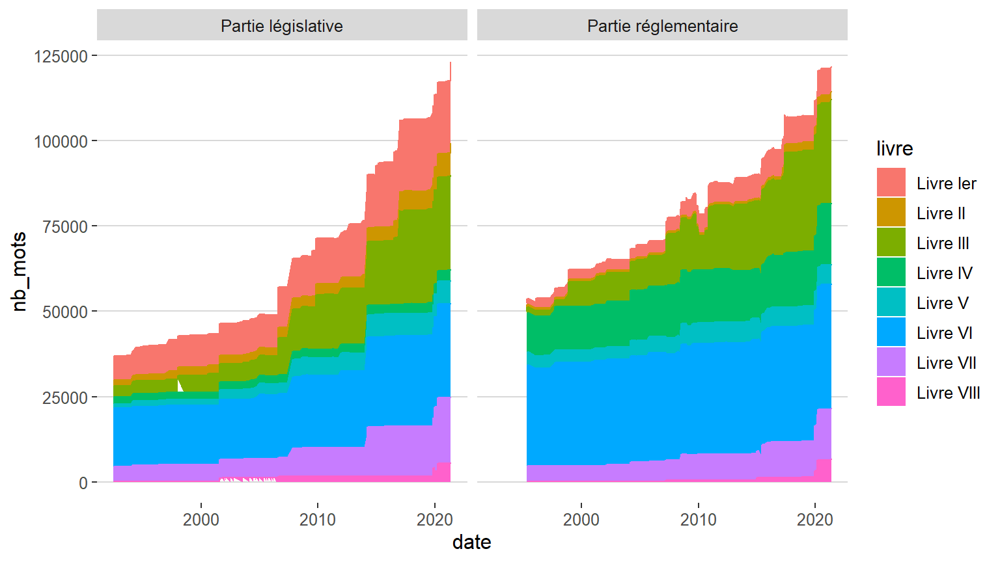
