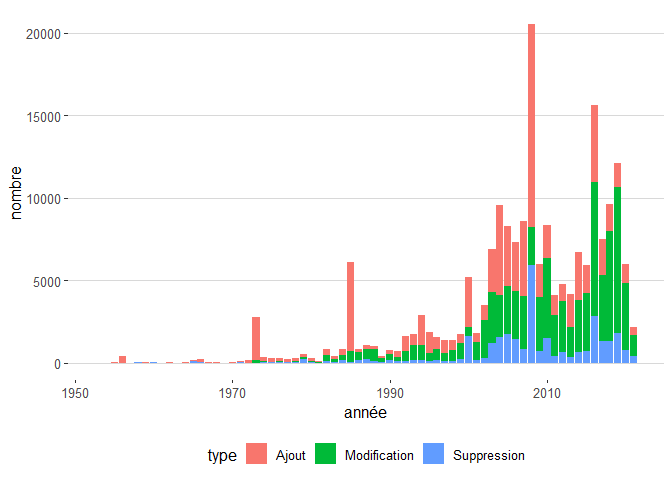

Legiplot
================

``` r
legiplot <- read.csv("diff_shortlist_t.csv",encoding ='UTF-8') %>% mutate(année = as.numeric(str_sub(date,1,4)))
```

## Données

``` r
legiplot %>%
  group_by(code) %>%
  summarise(
    nb_modifs = n(),
    début = min(date),
    fin = max(date),
    parties = n_distinct(partie),
    sous_parties = n_distinct(sous_partie),
    livres = n_distinct(livre),
    titres = n_distinct(titre),
    chapitres = n_distinct(chapitre)
  ) %>% kable()
```

<table>
<thead>
<tr>
<th style="text-align:left;">
code
</th>
<th style="text-align:right;">
nb\_modifs
</th>
<th style="text-align:left;">
début
</th>
<th style="text-align:left;">
fin
</th>
<th style="text-align:right;">
parties
</th>
<th style="text-align:right;">
sous\_parties
</th>
<th style="text-align:right;">
livres
</th>
<th style="text-align:right;">
titres
</th>
<th style="text-align:right;">
chapitres
</th>
</tr>
</thead>
<tbody>
<tr>
<td style="text-align:left;">
code\_civil
</td>
<td style="text-align:right;">
6248
</td>
<td style="text-align:left;">
1803-03-15
</td>
<td style="text-align:left;">
2021-01-01
</td>
<td style="text-align:right;">
1
</td>
<td style="text-align:right;">
1
</td>
<td style="text-align:right;">
7
</td>
<td style="text-align:right;">
70
</td>
<td style="text-align:right;">
214
</td>
</tr>
<tr>
<td style="text-align:left;">
code\_de\_commerce
</td>
<td style="text-align:right;">
16455
</td>
<td style="text-align:left;">
2000-12-14
</td>
<td style="text-align:left;">
2021-05-23
</td>
<td style="text-align:right;">
4
</td>
<td style="text-align:right;">
1
</td>
<td style="text-align:right;">
11
</td>
<td style="text-align:right;">
80
</td>
<td style="text-align:right;">
254
</td>
</tr>
<tr>
<td style="text-align:left;">
code\_de\_l’action\_sociale\_et\_des\_familles
</td>
<td style="text-align:right;">
8513
</td>
<td style="text-align:left;">
2001-07-18
</td>
<td style="text-align:left;">
2021-05-21
</td>
<td style="text-align:right;">
3
</td>
<td style="text-align:right;">
1
</td>
<td style="text-align:right;">
8
</td>
<td style="text-align:right;">
49
</td>
<td style="text-align:right;">
238
</td>
</tr>
<tr>
<td style="text-align:left;">
code\_de\_l’éducation
</td>
<td style="text-align:right;">
10754
</td>
<td style="text-align:left;">
2000-12-14
</td>
<td style="text-align:left;">
2021-05-24
</td>
<td style="text-align:right;">
2
</td>
<td style="text-align:right;">
6
</td>
<td style="text-align:right;">
15
</td>
<td style="text-align:right;">
97
</td>
<td style="text-align:right;">
274
</td>
</tr>
<tr>
<td style="text-align:left;">
code\_de\_la\_consommation
</td>
<td style="text-align:right;">
6235
</td>
<td style="text-align:left;">
1994-01-04
</td>
<td style="text-align:left;">
2021-04-16
</td>
<td style="text-align:right;">
4
</td>
<td style="text-align:right;">
1
</td>
<td style="text-align:right;">
16
</td>
<td style="text-align:right;">
63
</td>
<td style="text-align:right;">
227
</td>
</tr>
<tr>
<td style="text-align:left;">
code\_de\_la\_propriété\_intellectuelle
</td>
<td style="text-align:right;">
3227
</td>
<td style="text-align:left;">
1993-01-01
</td>
<td style="text-align:left;">
2021-05-14
</td>
<td style="text-align:right;">
2
</td>
<td style="text-align:right;">
6
</td>
<td style="text-align:right;">
17
</td>
<td style="text-align:right;">
27
</td>
<td style="text-align:right;">
111
</td>
</tr>
<tr>
<td style="text-align:left;">
code\_de\_la\_recherche
</td>
<td style="text-align:right;">
441
</td>
<td style="text-align:left;">
2004-08-11
</td>
<td style="text-align:left;">
2021-01-01
</td>
<td style="text-align:right;">
1
</td>
<td style="text-align:right;">
1
</td>
<td style="text-align:right;">
5
</td>
<td style="text-align:right;">
21
</td>
<td style="text-align:right;">
75
</td>
</tr>
<tr>
<td style="text-align:left;">
code\_de\_la\_santé\_publique
</td>
<td style="text-align:right;">
51280
</td>
<td style="text-align:left;">
1953-10-27
</td>
<td style="text-align:left;">
2021-05-27
</td>
<td style="text-align:right;">
6
</td>
<td style="text-align:right;">
10
</td>
<td style="text-align:right;">
87
</td>
<td style="text-align:right;">
290
</td>
<td style="text-align:right;">
1138
</td>
</tr>
<tr>
<td style="text-align:left;">
code\_de\_la\_sécurité\_intérieure
</td>
<td style="text-align:right;">
4700
</td>
<td style="text-align:left;">
2012-12-23
</td>
<td style="text-align:left;">
2021-05-27
</td>
<td style="text-align:right;">
2
</td>
<td style="text-align:right;">
1
</td>
<td style="text-align:right;">
9
</td>
<td style="text-align:right;">
59
</td>
<td style="text-align:right;">
165
</td>
</tr>
<tr>
<td style="text-align:left;">
code\_de\_la\_sécurité\_sociale
</td>
<td style="text-align:right;">
40633
</td>
<td style="text-align:left;">
1961-01-12
</td>
<td style="text-align:left;">
2021-05-23
</td>
<td style="text-align:right;">
5
</td>
<td style="text-align:right;">
1
</td>
<td style="text-align:right;">
37
</td>
<td style="text-align:right;">
185
</td>
<td style="text-align:right;">
646
</td>
</tr>
<tr>
<td style="text-align:left;">
code\_du\_travail
</td>
<td style="text-align:right;">
48381
</td>
<td style="text-align:left;">
1973-07-11
</td>
<td style="text-align:left;">
2021-05-27
</td>
<td style="text-align:right;">
6
</td>
<td style="text-align:right;">
9
</td>
<td style="text-align:right;">
76
</td>
<td style="text-align:right;">
342
</td>
<td style="text-align:right;">
1220
</td>
</tr>
<tr>
<td style="text-align:left;">
code\_pénal
</td>
<td style="text-align:right;">
3235
</td>
<td style="text-align:left;">
1992-07-23
</td>
<td style="text-align:left;">
2021-05-27
</td>
<td style="text-align:right;">
2
</td>
<td style="text-align:right;">
1
</td>
<td style="text-align:right;">
11
</td>
<td style="text-align:right;">
31
</td>
<td style="text-align:right;">
87
</td>
</tr>
</tbody>
</table>

## Nombre de modifications globales

``` r
legiplot %>%
  group_by(année,type) %>%
  summarise(nombre = n()) %>%
  ggplot(aes(x=année,y=nombre,fill=type)) +
  geom_col() +
  theme_hc()
```

    ## `summarise()` has grouped output by 'année'. You can override using the `.groups` argument.

<!-- -->

``` r
legiplot %>%
  filter(année > 1950) %>%
  group_by(année,type) %>%
  summarise(nombre = n()) %>%
  ggplot(aes(x=année,y=nombre,fill=type)) +
  geom_col() +
  theme_hc()
```

    ## `summarise()` has grouped output by 'année'. You can override using the `.groups` argument.

<!-- -->

``` r
legiplot %>%
  filter(année > 1950) %>%
  group_by(année,code) %>%
  summarise(nombre = n()) %>%
  ggplot(aes(x=année,y=nombre,color=code)) +
  geom_line() +
  facet_wrap(~code) +
  guides(color=FALSE) +
  theme_hc()
```

    ## `summarise()` has grouped output by 'année'. You can override using the `.groups` argument.

<!-- -->

``` r
legiplot %>%
  filter(année > 1999, code != "code_du_travail") %>%
  group_by(année,code) %>%
  summarise(nombre = n()) %>%
  ggplot(aes(x=année,y=nombre,color=code)) +
  geom_line() +
  facet_wrap(~code) +
  guides(color=FALSE) +
  theme_hc()
```

    ## `summarise()` has grouped output by 'année'. You can override using the `.groups` argument.

<!-- -->
