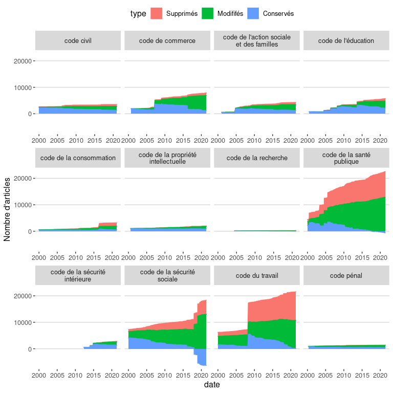

Function démo
================

## Arbres

``` r
source("legiplot_fun_tree.R")
```

    ## ── Attaching packages ─────────────────────────────────────── tidyverse 1.3.1 ──

    ## ✓ ggplot2 3.3.3     ✓ purrr   0.3.4
    ## ✓ tibble  3.1.2     ✓ dplyr   1.0.6
    ## ✓ tidyr   1.1.3     ✓ stringr 1.4.0
    ## ✓ readr   1.4.0     ✓ forcats 0.5.1

    ## ── Conflicts ────────────────────────────────────────── tidyverse_conflicts() ──
    ## x dplyr::filter() masks stats::filter()
    ## x dplyr::lag()    masks stats::lag()

    ## 
    ## Attachement du package : 'igraph'

    ## Les objets suivants sont masqués depuis 'package:dplyr':
    ## 
    ##     as_data_frame, groups, union

    ## Les objets suivants sont masqués depuis 'package:purrr':
    ## 
    ##     compose, simplify

    ## L'objet suivant est masqué depuis 'package:tidyr':
    ## 
    ##     crossing

    ## L'objet suivant est masqué depuis 'package:tibble':
    ## 
    ##     as_data_frame

    ## Les objets suivants sont masqués depuis 'package:stats':
    ## 
    ##     decompose, spectrum

    ## L'objet suivant est masqué depuis 'package:base':
    ## 
    ##     union

``` r
legiplot_load_tree()
```

``` r
legiplot_plot_tree("code de l'éducation")
```

    ## `summarise()` has grouped output by 'from'. You can override using the `.groups` argument.
    ## `summarise()` has grouped output by 'from'. You can override using the `.groups` argument.
    ## `summarise()` has grouped output by 'from'. You can override using the `.groups` argument.

<!-- -->

## Indicateurs

``` r
source("legiplot_fun_evol.R")
```

    ## 
    ## Attachement du package : 'cowplot'

    ## L'objet suivant est masqué depuis 'package:ggthemes':
    ## 
    ##     theme_map

``` r
legiplot_load_evol()
```

    ## `summarise()` has grouped output by 'code'. You can override using the `.groups` argument.

    ## `summarise()` has grouped output by 'code', 'date'. You can override using the `.groups` argument.

``` r
start <- "2000-01-01"
norm <- FALSE
plot_grid(
  legiplot_ind_plot("nb_mots","Nombre de mots par code",norm,start),
  legiplot_ind_plot("nb_alineas","Nombre d'alinéas par code",norm,start),
  legiplot_ind_plot("nb_articles","Nombre d'articles par code",norm,start),
  legiplot_ind_plot("alineas_par_article","Nombre d'alinéas par article",norm,start),
  legiplot_ind_plot("mots_par_article","Nombre de mots par article",norm,start),
  legiplot_ind_plot("mots_par_alinea","Nombre de mots par alinéas",norm,start)
)
```

<!-- -->

``` r
start <- "2000-01-01"
norm <- TRUE
plot_grid(
  legiplot_ind_plot("nb_mots","Nombre de mots par code",norm,start),
  legiplot_ind_plot("nb_alineas","Nombre d'alinéas par code",norm,start),
  legiplot_ind_plot("nb_articles","Nombre d'articles par code",norm,start),
  legiplot_ind_plot("alineas_par_article","Nombre d'alinéas par article",norm,start),
  legiplot_ind_plot("mots_par_article","Nombre de mots par article",norm,start),
  legiplot_ind_plot("mots_par_alinea","Nombre de mots par alinéas",norm,start)
)
```

<!-- -->

## Volumes

``` r
legiplot_vol_plot()
```

<!-- -->

``` r
legiplot_vol_plot("fill")
```

<!-- -->

``` r
legiplot_vol_plot(pos="fill",uncode="code de l'éducation")
```

<!-- -->

``` r
legiplot_vol_code("code de l'éducation")
```

    ## `summarise()` has grouped output by 'date', 'partie'. You can override using the `.groups` argument.

<!-- -->

## Diffs / Modifications

``` r
source("legiplot_fun_diff.R")
legiplot_load_diff()
```

    ## `summarise()` has grouped output by 'code', 'partie', 'sous_partie', 'livre', 'titre', 'chapitre'. You can override using the `.groups` argument.

    ## `summarise()` has grouped output by 'code'. You can override using the `.groups` argument.

    ## `summarise()` has grouped output by 'code', 'partie', 'sous_partie', 'livre', 'titre', 'chapitre', 'article'. You can override using the `.groups` argument.

    ## `summarise()` has grouped output by 'code', 'date'. You can override using the `.groups` argument.

``` r
legiplot_modifs_articles_plot()
```

<!-- -->

``` r
legiplot_modifs_articles_plot("code de l'éducation")
```

<!-- -->

``` r
legiplot_modifs_codes_plot()
```

<!-- -->

``` r
legiplot_modifs_codes_plot(pos="fill")
```

<!-- -->
