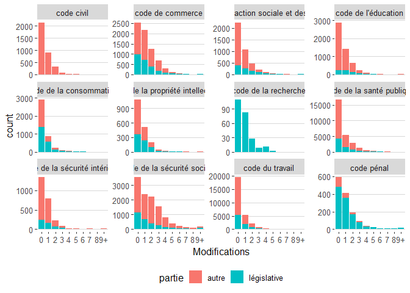

Legiplot modifications
================

## Modifications globales

``` r
lp_diff_shortlist_t <- read.csv("diff_shortlist_t.csv",encoding = "UTF-8", stringsAsFactors = TRUE) %>%
    mutate(code = factor(code, labels=str_replace_all(levels(code),'_',' '))) %>%
    mutate(
      année = as.factor(substr(date,1,4)),
      date = as.Date(date)
      )

lp_modifs_glob <- lp_diff_shortlist_t %>%
  group_by(code,partie,article,type) %>%
  summarise(nb = n()) %>%
  pivot_wider(names_from = type, values_from = nb, values_fill = 0) %>%
  mutate(partie = ifelse(str_detect(partie,"législative")|is.na(partie),"législative","autre")) %>%
  mutate(status = case_when(
    Suppression > 0 ~ "Supprimé",
    Modification > 0 ~ "Modifié",
    TRUE ~ "Ajouté/Conservé"
  )) 
```

    ## `summarise()` has grouped output by 'code', 'partie', 'article'. You can override using the `.groups` argument.

### Etat actuel

``` r
lp_modifs_glob %>%
  group_by(code,status) %>%
  summarise(nb_articles = n()) %>% 
  ggplot(aes(x=code,y=nb_articles,fill=status)) +
  geom_col(position = "fill") +
  #facet_grid(.~partie)+
  coord_flip()
```

    ## `summarise()` has grouped output by 'code'. You can override using the `.groups` argument.

<!-- -->

### Nombre modifications par articles

``` r
lp_modifs_glob %>%
  mutate(
    Modifications = ifelse(Modification<9,as.character(Modification),"9+")
  ) %>%
  ggplot(aes(x=Modifications,fill=partie)) +
  geom_bar() +
  facet_wrap(code~., scales = "free_y") +
  theme_hc()
```

<!-- -->

## Evolutions

``` r
lp_diff_shortlist_t <- read.csv("diff_shortlist_t.csv",encoding = "UTF-8", stringsAsFactors = TRUE) %>%
    mutate(code = factor(code, labels=str_replace_all(levels(code),'_',' '))) %>%
    mutate(
      année = as.factor(substr(date,1,4)),
      date = as.Date(date)
      )

lp_modifs_evol <- lp_diff_shortlist_t %>%
  arrange(date) %>%
  mutate(type = fct_recode(type, Ajout = "Préexistence")) %>%
  group_by(code,article,type) %>%
  summarise(across(everything(),first)) %>%
  group_by(code,date,type) %>%
  summarise(nb = n()) %>%
  group_by(code,type) %>%
  mutate(nb = cumsum(nb)) %>%
  pivot_wider(names_from = type, values_from = nb) %>%
  fill(Ajout,Suppression,Modification) %>%
  mutate(across(Ajout:Modification, ~ replace_na(.,0))) %>%
  mutate(Ajout_Conservation = Ajout - Modification - Suppression)
```

    ## `summarise()` has grouped output by 'code', 'article'. You can override using the `.groups` argument.

    ## `summarise()` has grouped output by 'code', 'date'. You can override using the `.groups` argument.

### Nombre de modifications

``` r
lp_modifs_evol %>%
  pivot_longer(c(Ajout_Conservation,Modification,Suppression), names_to = "status", values_to = "nb_articles") %>% 
  mutate(status = factor(status, levels = c("Suppression","Modification","Ajout_Conservation"))) %>%
  ggplot(aes(x=date,y=nb_articles,fill=status)) +
  geom_area(aes(color=status)) +
  facet_wrap(code~., scales = "free", ncol=3) +
  theme_hc()
```

<!-- -->
