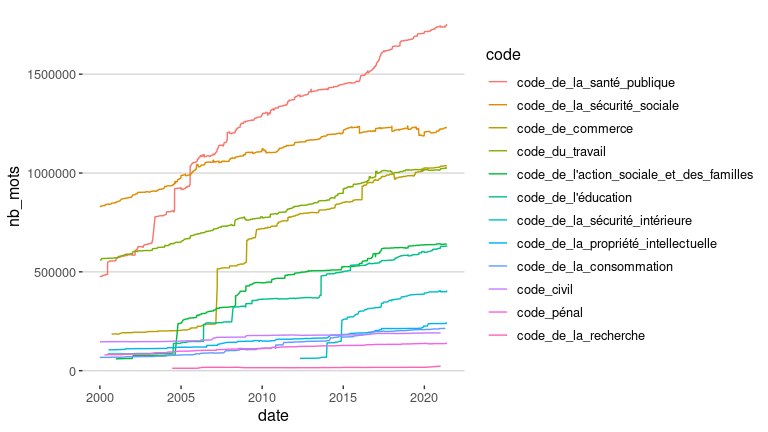
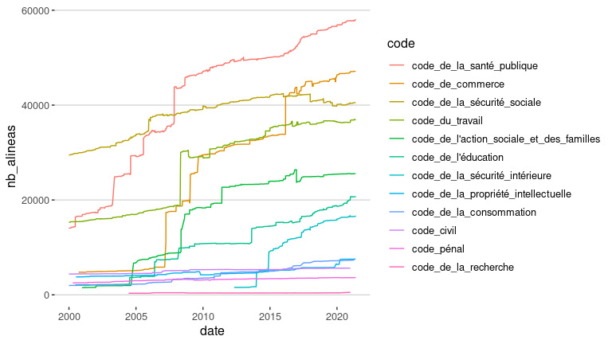
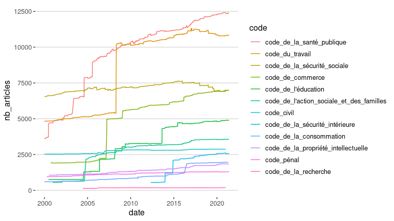
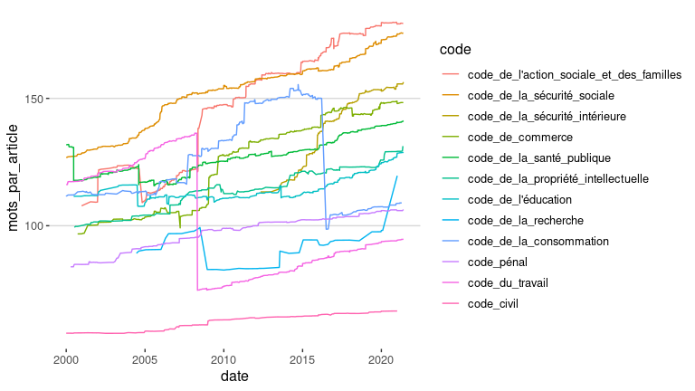
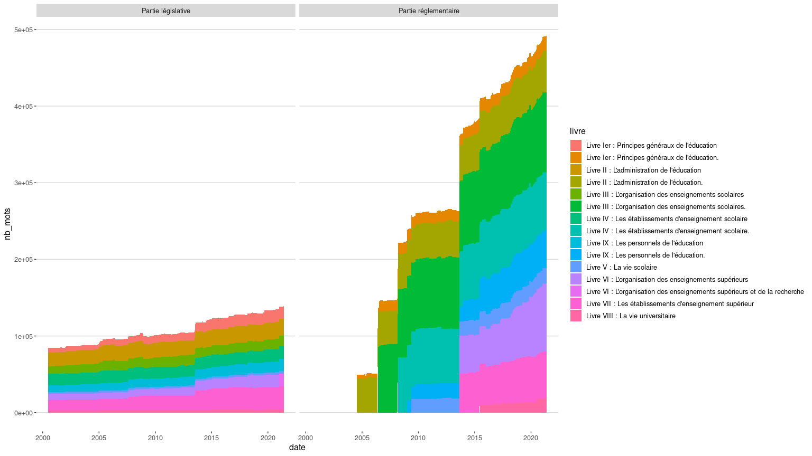

Legiplot Stats
================

<!-- -->

<!-- -->

<!-- -->

<!-- -->

<!-- -->

<!-- -->

## Législative vs. Réglementaire

<!-- -->

<!-- -->

    ## `summarise()` has grouped output by 'date', 'code'. You can override using the `.groups` argument.

<!-- -->

## Fouille de stats détaillées

``` r
stats.det <- read.csv("stats_shortlist_ts3.csv") %>%
  filter(code == "code_de_l'éducation") %>%
  mutate(date = as.Date(date)) 

stats.det %>%
  ggplot(aes(x=date,y=nb_mots,fill=livre)) +
  geom_area(aes(group=livre)) +
  facet_grid(.~partie)  +
  theme_hc() + 
  theme(legend.position = "right")
```

<!-- -->

Premier problème : les livres ne sont pas dans l’ordre : Livre IX &lt;
Livre V

Pour traiter ce problème, on force l’ordre des livres avec l’ordre dans
le csv:

``` r
stats.det %>%
    mutate_at(
    c("partie","sous_partie","livre"),
    function(x) factor(x,unique(x))
    ) %>%
  ggplot(aes(x=date,y=nb_mots,fill=livre)) +
  geom_area(aes(group=livre)) +
  facet_grid(.~partie)  +
  theme_hc() + 
  theme(legend.position = "right")
```

<!-- -->

Deuxième problème : des titres changent au cours du temps.

Pour traiter ce problème, on va supprimer ces titres :

``` r
stats.det %>%
  mutate_at(
    c("sous_partie","livre"),
    function(x) gsub("(.*) :.*", "\\1",x)
    ) %>%
    mutate_at(
    c("partie","sous_partie","livre"),
    function(x) factor(x,unique(x))
    ) %>%
  ggplot(aes(x=date,y=nb_mots,fill=livre)) +
  geom_area(aes(group=livre)) +
  facet_grid(.~partie)  +
  theme_hc() + 
  theme(legend.position = "right")
```

<!-- -->

## Fouille du code PI

<!-- -->
