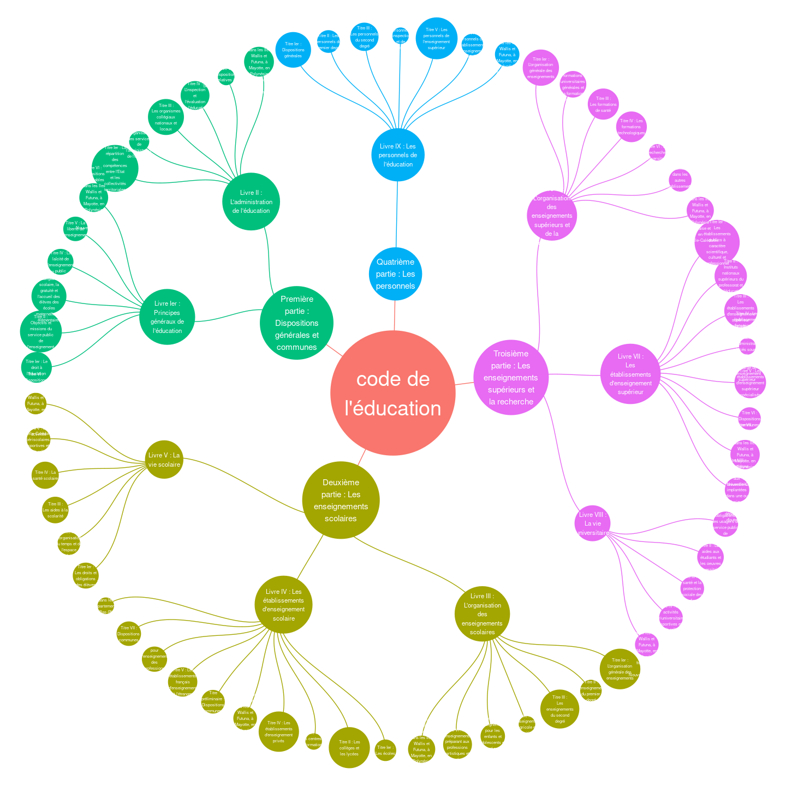

un arbre pour la structure de code
================

    ## `summarise()` has grouped output by 'from'. You can override using the `.groups` argument.
    ## `summarise()` has grouped output by 'from'. You can override using the `.groups` argument.
    ## `summarise()` has grouped output by 'from'. You can override using the `.groups` argument.

<!-- -->
