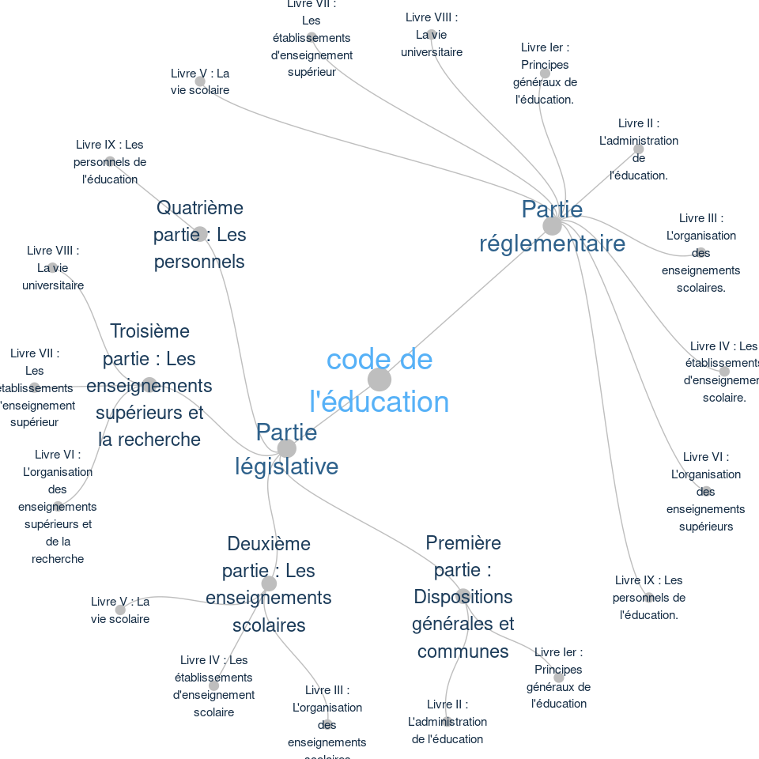

un arbre pour la structure de code
================

``` r
# create a data frame 
data <- read.csv("code_structure.csv",encoding = "UTF-8")%>%filter(code=="code_de_l'éducation")
data <- transform(data, sous_partie= ifelse(sous_partie=="", partie,sous_partie))
```

``` r
# transform it to a edge list!
edges_code_partie <- data %>% select(code,partie) %>% unique %>% rename(from=code, to=partie)

edges_partie_sousPartie <- data %>% select(partie,sous_partie) %>% unique %>% rename(from=partie, to=sous_partie)

edges_sousPartie_livre <- data %>% select(sous_partie, livre) %>% unique %>% rename(from=sous_partie,to=livre)

edges_livre_titre <- data %>% select(livre, titre) %>% unique %>% rename(from=livre,to=titre)

edges_titre_chapitre <- data %>% select(titre,chapitre) %>% unique %>% rename(from=titre,to=chapitre)

edges=rbind(edges_code_partie,edges_partie_sousPartie,edges_sousPartie_livre,edges_livre_titre,edges_titre_chapitre)
```

``` r
vertices = data.frame(
  name = unique(c(as.character(edges$from), as.character(edges$to)))
)

#set niveau pour le taille
mychapitre=which(is.na(match(vertices$name,edges$from)))
mytitre=which(!is.na(match(vertices$name,edges_livre_titre$to)))
mylivre=which(!is.na(match(vertices$name,edges_sousPartie_livre$to)))
mysouspartie=which(!is.na(match(vertices$name,edges_partie_sousPartie$to)))
mypartie=which(!is.na(match(vertices$name,edges_code_partie$to)))
mycode=which(!is.na(match(vertices$name,edges_code_partie$from)))

vertices$niveau[ mychapitre ] =1
vertices$niveau[ mytitre ] =2
vertices$niveau[ mylivre ] =4
vertices$niveau[mysouspartie]=8
vertices$niveau[ mypartie ] =16
vertices$niveau[mycode]=32

#set niveau group pour la couleur
vertices$group[ mychapitre ] ="NA"
vertices$group[ mytitre ] ="NA"
vertices$group[ mylivre ] ="NA"
vertices$group[ mysouspartie]="NA"
vertices$group[ mypartie ] =vertices$name[ mypartie ]
vertices$group[mycode]="code"
for (souspartie in mysouspartie)
 {
    find<-gsub("'", "''", vertices$name[souspartie])
    vertices$group[souspartie]<-sqldf(sprintf("select partie from data where sous_partie='%s'", find))$partie[1]
    
 }
 for (livre in mylivre)
 {
    find<-gsub("'", "''", vertices$name[livre])
    vertices$group[livre]<-sqldf(sprintf("select partie from data where livre='%s'", find))$partie[1]
 }

for (titre in mytitre)
 {
    find<-gsub("'", "''", vertices$name[titre])
    vertices$group[titre]<-sqldf(sprintf("select partie from data where titre = '%s'", find))$partie[1]
}

 for (chapitre in mychapitre)
 {
    find<-gsub("'", "''", vertices$name[chapitre])
    vertices$group[chapitre]<-sqldf(sprintf("select partie from data where chapitre = '%s'", find))$partie[1]
 }
```

``` r
mygraph<- graph_from_data_frame(edges,vertices=vertices) 
ggraph(mygraph, layout = 'dendrogram', circular =TRUE)+geom_edge_diagonal(colour="grey")+scale_edge_colour_distiller(palette = "RdPu") +geom_node_point(aes(colour=group,size=niveau*2))+geom_node_text(aes(label=name,colour=group),size=6)+theme_void()+theme(legend.position="none",plot.margin=unit(c(0,0,0,0),"cm"))
```

    ## Multiple parents. Unfolding graph

<!-- -->
